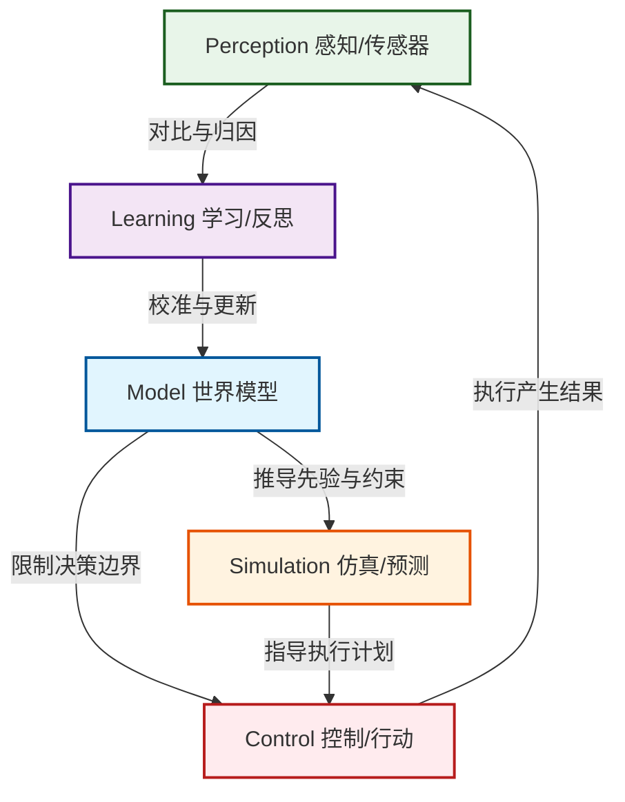

# Agent Memory MCP Server (Decision Memory)

> **“决策的本质，就是用过去的经验去预测未来，用未来的结果去修正经验。”**
> 
> **“记忆的本质，不是文件的堆砌，而是为未来的上下文窗口（Context Window）制造索引。LLM 只能激活它眼前的上下文，而双链和标签，就是在这个注意力的探照灯扫过来时，能为它连带拉出整张认知关系网络的那根绳索。一次任务里没有被当前 link/tag 通路激活的内容，就是本次推理中的‘遗忘’。”**

本项目是智能体决策系统的 **MCP (Model Context Protocol) 长期外部记忆服务器**。它通过严格的 **5 模块记忆结构（Cybernetic 5-Module Memory）** 以及 **Obsidian 双链网络（Wiki-Links Semantic Graph）**，为智能体（Agent）提供一个可被 LLM 注意力机制激活、可复盘、可演化的长期记忆底座。

---

## 核心一：五位一体长期记忆结构 (The Cybernetic Memory Loop)

本服务器强迫 Agent 将所有长期落盘内容收敛在 5 个核心记忆模块中，形成持续迭代的演进螺旋：

### 1. Model (世界模型 & 规则边界)
*   **物理路径**：`agent-memory/model/`
*   **语义定义**：关于客观世界运行规律的持久信念（如信用周期、估值均值回归）、个人约束（家庭目标、可承受回撤上限）以及在实践中被验证并沉淀下来的操作规则。
*   **作用**：是决策系统的“锚”，提供行动的物理规律、先验概率和硬性规则约束。

### 2. Simulation (前向仿真 & 概率测算)
*   **物理路径**：`agent-memory/simulation/`
*   **语义定义**：系统的“沙盘”。在采取任何行动之前，对未来的情景推演、标的涨跌预测、宏观 Thesis 论证、量化回测或概率估算。
*   **作用**：强迫 Agent 在行动前留下无偏见的书面预测，对抗事后诸葛亮偏差（Hindsight Bias）。

### 3. Control (决策控制 & 行动治理)
*   **物理路径**：`agent-memory/control/`
*   **语义定义**：行动的“方向盘”和“刹车”。包含宏观投资策略、定期调仓计划、具体的买卖执行决策、甚至包括在面临风险时**明确做出的“不行动/等待”决策**。
*   **作用**：基于 Model 的风险限制与 Simulation 的赢面估算，产生现实动作，并由安全审计层管控。

### 4. Perception (客观感知 & 事实记录)
*   **物理路径**：`agent-memory/perception/`
*   **语义定义**：系统的数据“传感器”。只记录真实发生的外部客观事实，例如美联储最新决议、公司原版财报、市场行情日线、账户资产快照等。
*   **作用**：提供最真实的物理反馈，禁止包含任何主观推论、归因或交易授权。

### 5. Learning (验证打分 & 反思进化)
*   **物理路径**：`agent-memory/learning/`
*   **语义定义**：系统的“修正器”。对比当初 Simulation 的预测、Control 的计划与后来 Perception 记录的真实结果，进行严格的胜率打分、归因分析、失误复盘和教训总结。
*   **作用**：生成 Model 的更新候选（Promotions），让过去的经验在反馈中自我修正，完成认知闭环。

> LLM 本身负责注意力、临时工作记忆和上下文组织；`agent-memory/` 只负责提供长期记忆单元及其 tag/link 连接。一次任务里没有被当前 link/tag 通路激活的内容，就是本次推理中的“遗忘”。

---

## 核心二：Obsidian 语义双链与图谱体系 (The Semantic Graph)

本服务器不是一个简单的扁平文件管理器，而是一个支持**语义双链图谱**的轻量级 Obsidian 图数据库。

### 1. 原生标签与分类机制 (`tags`)
每次通过 MCP 工具写入笔记时，服务器会自动根据分类追溯体系注入规范标签：
*   **系统级标签**：`#agent-memory/model`, `#agent-memory/simulation`...
*   **类型级标签**：`#{module}/{kind}`（如 `#model/world-system` 表示世界运行系统，`#simulation/prediction` 表示个股预测）。
*   **用户级标签**：随写入请求透传，用于跨模块聚合（如 `#ticker/goog` 追踪谷歌相关的所有认知节点）。

### 2. 双链网络与导航 API
系统支持使用 Obsidian 的维基链接 `[[Note_Title]]` 对知识节点进行任意关联：
*   **`read_note(note_ref)`**：支持通过绝对路径、相对路径、文件名、甚至笔记 Front-matter 中的 `title` 或 `wiki-link` 模糊匹配并解析读取笔记。
*   **`backlinks(note_ref)`**：查询有哪些笔记引用了当前笔记，帮助智能体发现哪些“决策”引用了某个“假设”，或者哪些“验证”证实了某个“世界模型”。
*   **`linked_chain(note_ref, depth)`**：基于图的宽度优先搜索，生成与目标笔记相关联的链式网络图谱，还原完整的认知脉络。

### 3. 全局链接重写与迁移引擎 (`rebuild_agent_memory.py`)
当我们需要对现有的库结构进行重组、清理或升级时，`rebuild_agent_memory.py` 提供了一键无损重建功能：
*   **重分类迁移**：将旧资产中的零散文件，按内容和关键字映射迁移到 `agent-memory/` 的五个核心子目录下。
*   **链接智能解析与重写**：在迁移每个笔记时，脚本解析其内部的 `[[...]]` 维基链接，并使用根据全局笔记的相对路径、标题、同名特征生成的 `link_map`，**自动重写链接目标**，确保迁移后的整个 Vault 图谱依然畅通且引用完整。

---

## 安全与写入审计 (Security Policies)

由于智能体拥有对库的写入权，为了保护个人资产隐私并维持知识库的“非执行”纯净性，[policy.py](file:///d:/investment/mcp_server/policy.py) 强制执行两项安全机制：

1.  **凭证与密码拦截（Secret Scanning）**：
    在任何写入或修改操作前，拦截并审计内容。若发现包含 `AIzaSy...` (Gemini API)、`sk-...` (OpenAI API)、明文的 `password/token` 等敏感凭证，自动阻断写入并报错，防止敏感密钥意外落盘。
2.  **代码防注入过滤（Script Jail）**：
    严禁向 `agent-memory/` 目录中写入 `.py`, `.sh`, `.ps1`, `.bat`, `.exe` 等可执行脚本，防止智能体将记忆库用作恶意代码执行的驻留区。

---

## 暴露的 MCP 工具列表 (Tools Reference)

| 工具名称 | 对应认知模块 | 主要功能 | 核心参数 |
| :--- | :--- | :--- | :--- |
| **`save_model`** | `model` | 写入稳定的世界规律、自我先验规则与资产约束。 | `kind` (如 `world/system`), `title`, `body`, `tags`, `links` |
| **`save_simulation`** | `simulation` | 写入仿真回测、情景分析或股票涨跌预测。 | `kind` (如 `prediction`), `title`, `body`, `tags`, `links` |
| **`save_control`** | `control` | 写入治理政策、调仓计划或买入卖出/不作为决策。 | `kind` (如 `decision`), `title`, `body`, `tags`, `links` |
| **`save_perception`** | `perception` | 写入客观外部事实、公司公告、真实行情与资产状态。 | `kind` (如 `observation`), `title`, `body`, `tags`, `links` |
| **`save_learning`** | `learning` | 写入反思打分、归因校验、以及 model 更新候选。 | `kind` (如 `practice-review`), `title`, `body`, `tags`, `links` |
| **`read_note`** | - | 根据路径、标题、别名或维基链接，读取完整笔记及元数据。 | `note_ref` (支持模糊检索) |
| **`search_notes`** | - | 支持关键词、模块、标签、种类、状态组合的综合多维检索。 | `query`, `module`, `tags`, `kind`, `status`, `limit` |
| **`backlinks`** | - | 查询所有指向本笔记的逆向反向链接。 | `note_ref` |
| **`linked_chain`**| - | 广度优先遍历链向，返回局部维基链接网络关系图谱。 | `note_ref`, `depth` |
